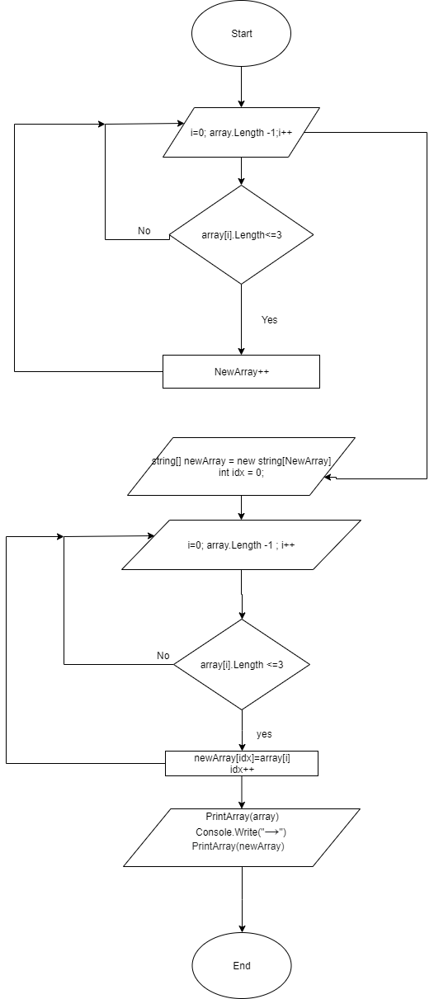

# Итоговая проверочная работа
Задача алгоритмически не самая сложная, однако для полноценного выполнения проверочной работы необходимо:

* Создать репозиторий на GitHub
* Нарисовать блок-схему алгоритма (можно обойтись блок-схемой основной содержательной части, если вы выделяете её в отдельный метод)
* Снабдить репозиторий оформленным текстовым описанием решения (файл README.md)
* Написать программу, решающую поставленную задачу
* Использовать контроль версий в работе над этим небольшим проектом (не должно быть так, что всё залито одним коммитом, как минимум этапы 2, 3, и 4 должны быть расположены в разных коммитах)

## Задача:

* Написать программу, которая из имеющегося массива строк формирует новый массив из строк, длина которых меньше, либо равна 3 символам. _Первоначальный массив можно ввести с клавиатуры, либо задать на старте выполнения алгоритма. При решении не рекомендуется пользоваться коллекциями, лучше обойтись исключительно массивами._

## Примеры:

[“Hello”, “2”, “world”, “:-)”] → [“2”, “:-)”]
[“1234”, “1567”, “-2”, “computer science”] → [“-2”]
[“Russia”, “Denmark”, “Kazan”] → []

# Решение
1. Репозиторий "itog"
2. Блок-схема алгоритма:

3. Данный файл является файлом README.md и пригоден только для чтения.
4. У программы только одна ветка *"master"*
5. Код:

Commands();

string[] array = new string[] {};

string fromUser = ReadInput("Введите команду: ");

switch (fromUser)

{
    
    case "1":
        array = new string[] { "Hello", "2", "world", ":-)" };
        break;
    case "2":
        array = new string[] { "1234", "1567", "-2", "computer science" };
        break;
    case "3":
        array = new string[] { "Russia", "Denmark", "Kazan" };
        break;
    default:
        Console.WriteLine($"{fromUser} - Такой команды нет");
        break;
}

int NewArray = 0;

for (int i = 0; i <= array.Length - 1; i++)

{
    
    if (array[i].Length <= 3) NewArray++;
}

string[] newArray = new string[NewArray];

int idx = 0;

for (int i = 0; i <= array.Length - 1; i++)

{
    
    if (array[i].Length <= 3)
    {
        newArray[idx] = array[i];
        idx++;
    }
}

PrintArray(array);

Console.Write(" → ");

PrintArray(newArray);

void Commands()

{
    
    Console.WriteLine();
    Console.WriteLine("СПИСОК КОМАНД:");
    Console.WriteLine("1 – использовать массив: [“Hello”, “2”, “world”, “:-)”]");
    Console.WriteLine("2 – использовать массив: [“1234”, “1567”, “-2”, “computer science”]");
    Console.WriteLine("3 – использовать массив: [“Russia”, “Denmark”, “Kazan”]");
    Console.WriteLine();
}

string ReadInput(string msg)

{
    
    Console.Write(msg);
    return Console.ReadLine();
}

void PrintArray(string[] array)

{
    
    Console.Write("[ ");
    for (int i = 0; i < array.Length; i++)
    {
        Console.Write($"“{array[i]}”, ");
    }
    Console.Write("] ");
}

6. На этом всё